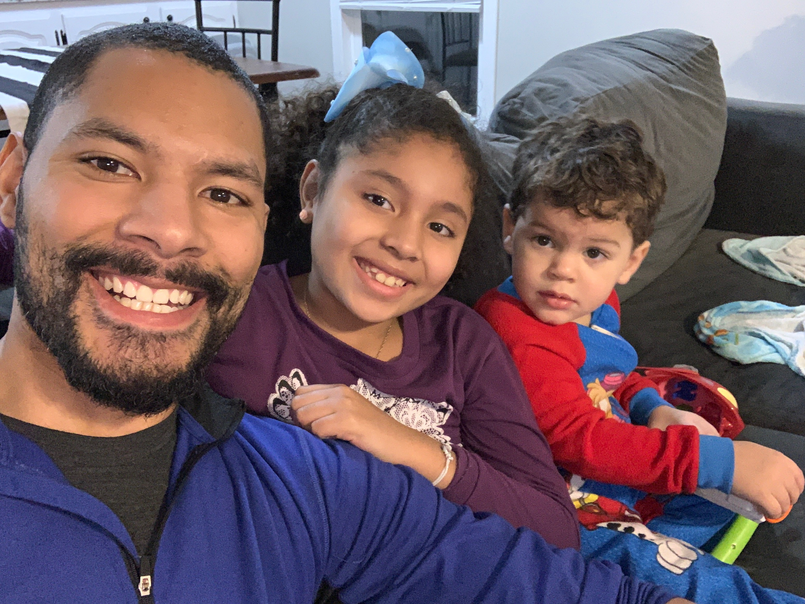
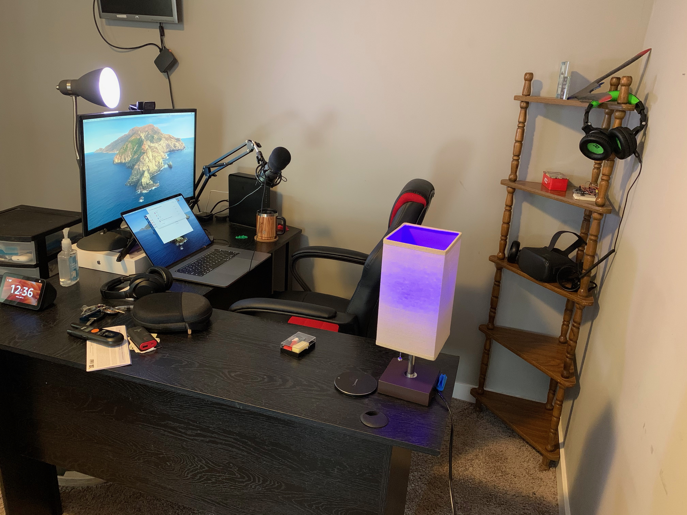

# Know Your Instructor

Hey hey 👋🏽

I figure since you have to see me and listen to my voice for a while, you might as well get to know a bit about myself outside of this training!

Even though I've been training for the past 3 years, I've actually worn a lot of different hats in the 8 years that I've been building applications.

Just to get something out of the way, I'll share an interesting fact about myself:

> 🚨I'm a self-taught developer😮🚨

Over the years, I've worked in fashion, I've been a reporter, I was elected chairman of the Davenport Civil Rights Commission, and when it comes to tech, I've been a freelancer, a consultant, and salaried employee for both large and small companies. It's been a crazy ride!

However, when it comes down to it, my motivation for doing so has always been because of the job I hold my important:

My crazy kids keep me motivated to prove that anything is possible if you work towards that goal.

---

## How I Teach

You may have picked up by now that I'm not the most formal of instructors 😅
This is actually on purpose! Being self-taught, I'm a huge advocate for the new, junior, and intermediate developers. As such, I believe learning in a strict, formal atmosphere can harm the learning experience. Because of that, I like to live-code so that others see my mistakes, I don't like to use slides and I do my best to use relatable metaphors and visuals.

🗒️ Feedback is always appreciated!

## My Setup

I get asked from time to time, what my setup looks like, so I'm adding this section in here.

- 2019 MBP (non-deere)
- Mic: AT2020+
- Monitor: 30 inch curved display
- Webcam: Logitech c290
- Ring Light: Meifigno Selfi Ring
- RGB Lights: LiFX mini Bulbs
- Course: GatsbyJS (react), CodeSandbox, Netlify
- Cartoon images of myself: Pablo Stanley Open Peeps
