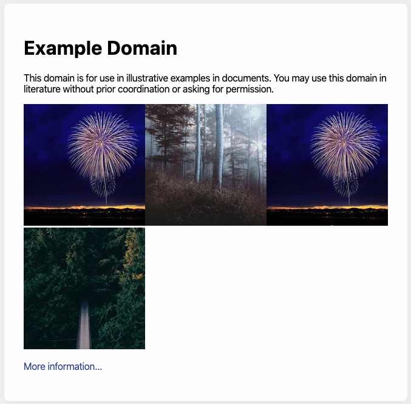

# Welcome to your first module!

While each module builds one the knowledge gained from the previous, they are designed to work as isolated pieces of knowledge.

As such, let's start with the most fundamental piece of the web: **HTML**

# Hyper Text Markup Language

I'm definitely not going to bore you with the history of HTML😴 Let's instead focus on some of the most important aspects of it, so that we can be most productive!

## Layout

HTML is read top to bottom and is broken up into 2 main parts: Information for the user (someone visiting the page), and information for the browser. Let's consider the following code example:

```html
<!DOCTYPE html>
<html lang="en">
  <head>
    <meta charset="UTF-8" />
    <meta name="viewport" content="width=device-width, initial-scale=1.0" />
    <meta http-equiv="X-UA-Compatible" content="ie=edge" />
    <title>Document</title>
  </head>
  <body>
    <h1>Hello</h1>
  </body>
</html>
```

First we tell the browser that we're using HTML 5 by specifying the documument type.

From there, our `html` is split into two sections: `head` and `body`. Everything inside of the `head` tags are what's known as _children_, the same with everything inside the `body` tag.

The thing to remember is that only the "Hello" inside the `body` tag will be visible to the user.

### Inline vs Block Elements

The other aspect to HTML layout is that some items are _block_ elements, meaning they take up an entire row, and some are _inline_ meaning they will be placed on the same row as other inline content. For example:



In the image above, the title text is a block element, same as the paragraph underneath, following that are 4 images. Images in HTML are inline elements, finally there is a paragraph tag at the bottom.

## Common Elements

There are many close to 100 tags in HTML, however in reality, we'll typically use around 10-20 in a given app. Below are the most common.

| Tag    | Description                                                       | Display                                   | Inline or Block                          |
| ------ | ----------------------------------------------------------------- | ----------------------------------------- | ---------------------------------------- |
| h1-h6  | Header Text                                                       | \<h1\>Hi\</h1\>                           | Block                                    |
| p      | Paragraph Text                                                    | \<p\>Hello\</p\>                          | Block                                    |
| img    | Displays an image                                                 | \      | Inline                                   |
| a      | "anchor" tag to display links                                     | \<a href="https://google.com">Google\</a> | Inline                                   |
| ul/ol  | Used to display a bulleted (unordered) or numbered (ordered) list | \<ul> \<li>Tacos\</li> \</ul>             | Block, however the list-items are inline |
| input  | Gather input from a user                                          | \<input/>                                 | inline                                   |
| div❌  | Generic divider element, has no real meaning                      | \<div>A section on the page\</div>        | Block                                    |
| span❌ | Generic divider element with no real meaning                      | \<span>Michael Liendo\</span>             | Inline                                   |

> 🗒️ Some elements, like img tags are "self-closing", meaning they don't follow the `<element>stuff</element>` syntax.

## ID's and Classes

Let's imagine the following snippet from an HTML page:

```html
<h1>Hello</h1>
<p>This is my first webpage!</p>
<p>Do you like it?</p>
<p>It didn't take too long to make.</p>
```

In the above code snippet, we have three paragraphs. How can we make a distinction between the first paragraph and the second one? Also, what if we wanted to group the first and third paragraph, but not the second?

Careful eyes may have noticed in the above table that the `img` and `a` tags took in additional information ie ``. Those are called _attributes_ an `id` is another attribute that uniquely identifies an element. Conversely, a `class` is an attribute that groups elements together.

Let's see what our above snippet looks like now that we have classes and id's.

```html
<h1>Hello</h1>
<p id="exciting-part" class="larger-text">This is my first webpage!</p>
<p id="make-italic">Do you like it?</p>
<p class="larger-text">It didn't take too long to make.</p>
```

## Semantic Elements

HTML5 brought the formal introduction of [semantic elements](https://www.w3schools.com/html/html5_semantic_elements.asp). These elements are typically block elements and serve the purpose of structuring our content. The provided link offers more details, though it's important to note that we'll the following are particularly common:

`header`, `footer`, `nav`, `article`, `section`, `form`

---

# 💅🏽CSS - Cascading Stylesheets

As you may have noticed, having a webpage with nothing but HTML elements is kind of lame. While all browsers put their own touch of default styling on a webpage, it really is up to us to decide how our webpages should look and feel.

It's entirely possible to deliver a _vastly_ different experience to your users by keeping the HTML content the same, but modifying the CSS. A fantastic example of this is [CSS Zen Garden](http://www.csszengarden.com/).

Learning CSS is it's own course in itself, so instead of going into any detail, let's take a practical approach by building our first project together.

---

# Photo Viewer

In this project, you'll follow along as I build a responsive photo viewer with HTML and CSS. You gain exposure to various properties and techniques that modern CSS has to offer, as well as how to layout content with flexbox.

The tool I'll be using to scaffold our application is called [Excalidraw](https://excalidraw.com/) and is excellent to fast mockup creation. If wanting to take a quick tour of it's features, I created a video for you to view:

https://youtu.be/JvDmJybANCQ

---

### Alright let's get started!

Feel free to develop in the below sandbox, just note that if you refresh the page, you'll lose all of you changes 😱 Instead, I recommend clicking the "Open Sandbox" button and when you get to the webpage, click the "Fork" button on the top-right corner.

https://codesandbox.io/s/photo-viewer-starter-ks1jd
