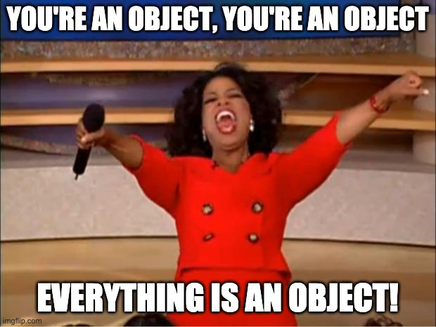

Now that we have an understanding of how a web page is structured (HTML) and how it's styled (CSS), let's take a look at how we can add interactivity and dynamic content with JavaScript.

# The Basics

Let's start with a couple concepts that are common across most programming languages

## Declaring and Assigning Variables

Back in the day, we had one keyword used to declare our variables, `var`. Relatively new in JavaScript (2015) are better alternatives: `const` and `let`.

While the `var` keyword doesn't go away in JavaScript, it's not used in any of the applications we'll be building as `const` and `let` will be used as better alternatives.

### const vs let

`let` behaves very much like `var` however it's more predictable. Let's look at a quick code snippet to get a better idea.

```js
var firstName = 'Michael'

if (name === 'Michael') {
  // 👆🏽Note that "var lastName..." is being declared inside of these curly braces

  var lastName = 'Liendo'
}

console.log(lastName) // "Liendo" 🤔
```

However, the `let` (and `const`) keyword respects braces as being a sort of bounding block:

```js
var firstName = 'Michael'

if (name === 'Michael') {
  let lastName = 'Liendo'
}

console.log(lastName) // 🚨 Error: lastName is not defined
```

`const` short for constant, can be a bit misleading when first learing. What we really mean is that what is declared as `const` can't be reassigned, not so much that it can't be changed.

Let's look at some examples.

> 🗒️ In the code above and below note that I snuck in something new: the `console.log()` _function_. We'll go into the details later, but for now, know that it let's us display content in our browser's console, as opposed to on our webpage.

https://codesandbox.io/s/const-and-let-examples-nqvf6

The rule of thumb, and the convention that we'll be using in this course: Define all variables as `const` and if you need to update their value, then change it to `let`.

## JavaScript Types

In the above examples, I casually introduced you to three of JavaScript's types: `string`, `number`, `boolean`, and `undefined`. These are known as _primitive types_.

### Understanding Primitive Types in JavaScript

The main thing to know about primitive types--commonly referred to as "basic types", is that they're passed to _value_.

To get a better understanding of what I mean, let's look at an example:

```js
let food //food is declared, but currently has a value of "undefined"

food = 'tacos' //food is assigned a vlue

const myFavoriteFood = food // myFavoriteFood now equals "taco"

food = 'Hamburgers'
console.log(myFavoriteFood) // What is the value?? 🧐
```

<details>
  <summary><b>Click here for the answer, and explanation</b></summary>
  <p>tacos</p>
  <p>Because <i>strings</i> , <i>booleans</i>, and <i>numbers</i> don't take a lot of memory to create, a copy of the the value is made, as opposed to a direct link.</p>
</details>
<br/>

Now that we understand how primitive types are created, updated, and copied from one variable to another, let's hold off on learning about _composite types_ for the time being, and take a quick detour to learn about conditionals and equality in JavaScript.

## Conditionals, Equality, and Comparisons in JS

Any programming language worth it's weight, has a way to handle control flow. JavaScript is no exception. Fortunately, the syntax of JavaScript makes this relatively easy to reason about for those new, unfortunately, there are some scenarios that we'll have to consider, that'll I'll make sure to point out.

### Equality Part 1

To assign a variable a value, we know by now that we use the `=` sign.

`const greeting = 'hello'`

To check for if two items are equal, we _can_ use two equal signs

`const isEqual = 3 == 3`

`console.log(isEqual) //true`

However, note that when using the double equal sign, the following situations arise:

If you ask JavaScript if `"3"` and `3` are the same thing, it'll say yes😱

If you ask JavaScript if `0` and `false` are the same thing, it'll say yes🙀

If you ask JavaScript if `"1"` and `true` are the same thing, it'll say yes🤔

> 🗒️ **This is because Javascript has a concept of _loose equality_ and _strict equality_**

Using the double equal sign opts us into _loose equality_ adding a third equal sign allows for _strict equality_.

Feel free to play around in the sandbox below to get a better idea.

https://codesandbox.io/s/javascript-equality-examples-l8xtn?file=/src/index.js

Because of this, it's considered best practice to use the triple equals `===` at all times, and not use the double `==` equals for equality checks.

In addition to checking if something is equal or not, JavaScript has the following operators that we'll be using through the course:

```md
| **Operator** | **Description**            |
| ------------ | -------------------------- |
| >            | Greater Than               |
| <            | Less Than                  |
| !            | Logical "not" !===         |
| >=           | Greater than or equal to   |
| <=           | Less than or equal to      |
| `||`         | Logical "or" 3`||` 7       |
| &&           | Logical "and" 2 && "hello" |
```

### Exploring Conditionals

In this course, we will explore three main types of conditionals. Each comes with their own set of use cases. They are the _if-statment_, _switch-case_ and the _ternary operator_. We'll explore the latter two as need be, but in this module, we take a glance at an if-statement.

**If-Statement**

```js
const name = 'Michael'

if(name=== "Michael") {
  console.log('Hello, Mr. Liendo')
}
// We can optionally add else-statements to our if-statements

const age = 31

if(age>= 31) {
  console.log('Wow..you're getting old.')
}else {
  console.log("You're still a child")
}
```

## 🚨Project Time🚨

Let's build a trivia game where the user has to guess the answer to 5 (easy) questions.

### Game Overview

- The game is played in the browser
- The user is asked their name via the `prompt()` function. Their name is stored for later use.
- Questions and answers are stored in variables (only basic types are used).
- The user's score is initially zero. If they get the the answer correct, the score increases.
- The user submits their answers via the `prompt()` function.
- At the end of each answer, the score will either increase or stay the same, and the next question will appear.
- Once the user has answered all of the questions, an `alert()` function will trigger, letting them know their score given in the following format:

- **0-2** "Oh wow {name}, you can do better."
- **3-4** "Keep practicing {name}, you got this!"
- **5** "Wow {name}, a perfect score!"

To get started, feel free to fork the sandbox below

https://codesandbox.io/s/trivia-with-basic-types-starter-w0j8j

<details>
  <summary><b>After giving it your best shot, click here to see how I would tackle it.</b></summary>
  <iframe
     src="https://codesandbox.io/embed/trivia-with-basic-types-final-tv3xg?fontsize=14&hidenavigation=1&theme=dark"
     style="width:100%; height:500px; border:0; border-radius: 4px; overflow:hidden;"
     title="trivia-with-basic-types-final"
     allow="geolocation; microphone; camera; midi; vr; accelerometer; gyroscope; payment; ambient-light-sensor; encrypted-media; usb"
     sandbox="allow-modals allow-forms allow-popups allow-scripts allow-same-origin"
   ></iframe>
</details>
<br/>

---

☕ We just tackled a lot, in a short amount of time! Now's a good time to take a break!☕

## Complex Data Types

Now that we have a grasp on control flow and primitive types, we can take it to the next level and learn about arrays, objects, and functions!

### Arrays

An array is simply put as a collection of items. Commonly known as a "list" in other programming languages, arrays are denoted by the use of brackets `[ ]`

So if I wanted a list of names, I could say

```js
const names = ['Michael', 'Kendall', 'Remmy', 'Xavier']
```

> 🗒️ Note that while JavaScript doesn't care about what types of data you put in an array, it's common to keep them all the same type.

**Accessing Items**

You're likely to hear the phrase, "array's are index based". What this means is that to access an item in an array, you reference it by its location. However, it's important to note that arrays are index-based.

As always, let's take a look at an example:

```js
const foods = ['tacos', 'fruit snacks', 'filet mignon']

const myFavoriteFood = foods[0]
const myGuiltyPleasure = foods[1]
const foodImBuyingAfterQuarantine = foods[2]
```

**Updating Items**

Updating Array values is fairly straight forward since the items themselves are primitive values:

```js
const legalSmokingAges = [18, 25, 40]
legalSmokingAges[0] = 21
```

> 🗒️ Removing and adding items will be discussed in the next module.

> 🗒️ The convention for naming array variables is that they are plural, or that they end in "List", avoid ambiguous names like "a" or "myArray".

### Objects

While we're talking about food, note that objects are the bread and butter of JavaScript development.



What kind of type is an array...an object.

What kind of type is a function...an object.

When expressing "nothing" we say `null`, and what is its type... you guessed it.

Objects are used to hold pieces of related information and are called "dictionaries" in other languages. This is because they work in a `key: value` fashion, similar to how a dictionary has a `word:definition`.

**"Pieces of related information?"**

Where arrays are simply containers to list any kind of data, objects are best used when the data has attributes. Take a person for example:

While we could create a person like so:

```js
❌
const person = ['brown eyes', 'dark hair', 'tall' ]
```

note that this breaks our convention since it doesn't end in an "s" or "list".

An object is best used in this case.

```js
✅
const person = {
  eyes: "brown",
  hair: "dark",
  height: "tall"
}
```

Just like array, the values in objects can hold any kind of data:

```js
const dog = {
  breed: 'Chocolate lab',
  age: 1,
  barksAlot: true,
  hobbies: ['barking', 'eating my sons toys', 'giving snuggles'],
  name: {
    firstName: 'Remmy',
    lastName: 'Liendo',
    nickName: "Don't chew that!",
  },
}
```

As you can see, object are very versatile in JavaScript! To access an objects values, we use _dot-notation_.

```js
const myDogsName = dog.name.firstName
const myDogsAge = dog.age
```

<details>
  <summary><b>How would you access the last hobby? Click here for the answer.</b></summary>
  <pre class="language-js"><code class="language-js">const myDogsBestQuality = dog.hobbies[2]</code></pre>
</details>

**Updating Items**

Updating objects follows the same rules as arrays (remember, arrays are jus a special type of object):

```js
dog.name.nickName = 'Sir Remington'
```

> 🗒️ Removing and adding items will be discussed in the next module.

---

🚨PROJECT TIME🚨

Using our newfound knowledge of complex data structures, refactor the previous trivia game to clean up the code a bit.
