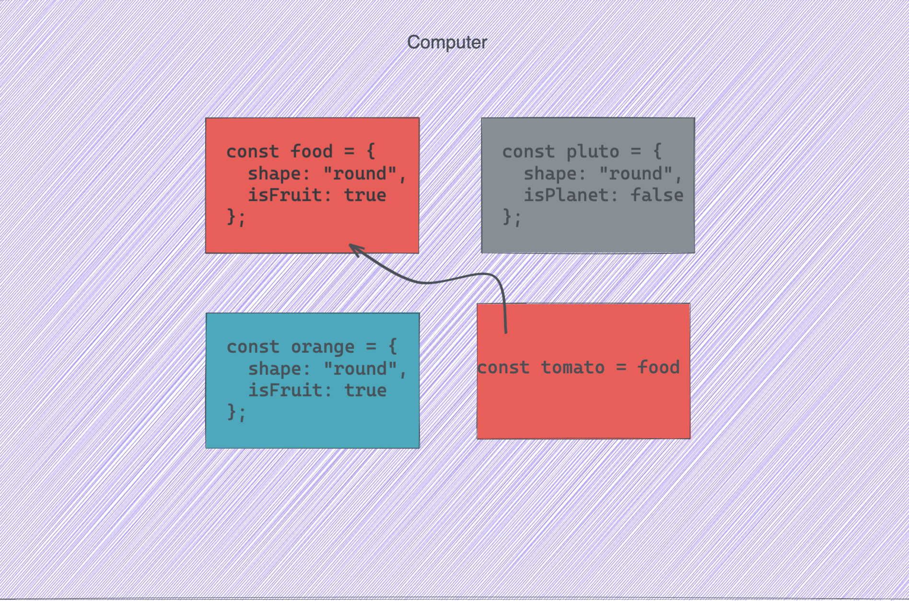

# Practical JavaScript

This section is all about taking the knowledge we learned in the previous section, and putting it to use to make Real World™️ applications.

However, before we can get there, we have a few gaps in our knowledge that we'll need to discuss, primarily around complex data types (objects and arrays).

## Equality Part 2

In the previous module, we talked about how we'll always favor the triple equals sign, as opposed to the double equals sign. This allows us to stay in control of what types of data we're working with, instead of JavaScript trying to figure it out for us.

This becomes particularly important when comparing objects, arrays, and as we'll soon learn about, functions.

Take the following example:

```js
const me = {
  name: 'Michael',
}

const you = {
  name: 'Michael',
}

console.log(me === you) // ?
console.log(me == you) // ?
```

<details>
  <summary>Click to answer: Does the <i>me</i> object equal the <i>you</i> object🤔</summary>
<b>No.</b> This is because complex data types are not equal based on what they contain, but rather where they are stored in memory. Irregardless of the use of loose or strict equality.
</details>

The information contained in the dropdown above is worth repeating again:

> 🗒️ **_Complex data types are not equal based on the data they contain, but rather where they are stored in memory._**

I don't know about you, but this sounds a bit too computer-sciency for me.

Here's an award-winning picture I created to help visualize.



Let's also explore what this means and why this is so important in the following codeSandbox:

https://codesandbox.io/s/object-array-equality-vnyx7?file=/src/index.js

So in short, if you're creating a variable that's based off of a primitive type, you're all good. But if you're doing the same--but with a complex type, watch out!

> _Ok, so how do I safely make copies that don't reference one another?_

Great question!

✨**Enter the Spread Operator**✨

One thing we haven't talked about yet, is how to iterate (loop-over) data. Don't worry, I have a good reason for that! But when it comes to the spread operator, I want to give some context on how it used to be done--which was to use a traditional for-loop:

```js
// The source of truth in an application
const jdLawnTractors = [
  '100 Series',
  'S240 Lawn Mower',
  'X300 Select Series',
  'X500 Select Series',
]

// The task: Add "Liendo Master Deluxe" to the end the array, without updating the original

//❌ create a new variable based on the original
const updatedList = jdLawnTractors
updatedList[jdLTractors.length] = 'Liendo Master Deluxe'

//🙅🏽‍♂️ Create a new array by looping over the original array
const updatedList = []

for (let i = 0; i < jdLawnTractors.length; i++) {
  updatedList[i] = jdLawnTractors[i]
}

//✅ Introducing the ✨spread-operator✨
const updatedList = [...jdLawnTractors, 'Liendo Master Deluxe']
```

That's right! The spread-operator is just three dots `...`
Lets's break this down:

```js
const updatedList = [] // We create a new array, as usual
```

```js
const updatedList = [jdLawnTractors]
//We put in the array we want to copy
```

```js
const updatedList = [...jdLawnTractors]
//We don't want an array inside on an array!
//So we use the spread-operator to say,
//"take all of your contents inside of you, and list (spread) them out"
```

```js
const updatedList = [...jdLawnTractors, 'Liendo Master Deluxe']
// With our copy successfully made,
//the only thing left to do is add our new value to the end

//👀 Curious audiences may recall that arrays are simply a special kind of object.
// This means that objects can use the spread-operator also!

const instructor = {
  name: 'Michael',
  title: 'UX Engineer',
}

const updatedInstructor = {
  ...instructor,
  title: 'UX Engineer | Sr. FED Instructor',
  twitter: '@mtliendo',
}
```

## JavaScript Functions

If you understand objects, functions, and asynchronous code, then you understand JavaScript.

With the asynchronous code being disussed in the next module, you're well on your way to becoming quite acquainted with the language👏🏽

---

In many ways, functions are no different from other languages. Take the following example of a JavaScript function:

```js
function sayHi() {
  console.log('hi')
}
```

This is one of the most basic ways to create a function. In JavaScript there are many ways. If we wanted to call the function, we could do so as such:

`sayHi() //'hi' gets logged to the console`

Of course, functions would be boring if all we did was log static content. Let's make it a bit more dynamic with arguments being passed in.

```js
const firstName = 'Michael'

function sayHi(name) {
  console.log(`Hi, ${name}.`)
}
```

> 🗒️ Functions in JavaScript can take in as many arguments as we want.

Functions can also return data back when they are called. We do this with the `return` keyword.

```js
const firstName = 'Michael'

function sayHi(name) {
  console.log(`Logging: Hi, ${name}.`)
  return `Hi, ${name}.`
}

const greeting = sayHi(firstName)
```

These are pretty basic function examples. In es6, JavaScript introduced _arrow-functions_. Let's look at a couple different ways to create functions, along with a look into what arrow-functions are.

https://codesandbox.io/s/javascript-functions-zjy7q?file=/src/index.js

## 🚨Putting It All Together🚨

Let's take everything we've learned so far, and try to create a recipe sheet that we can refer to when we get stuck

https://codesandbox.io/s/function-recipes-ekits?file=/src/index.js

### Methods on Objects

Phew, that was a lot to take in! The good news is that it's all down hill from here. The bad news is that we're not done yet!

Let's revisit our dear friend the object.

We know it holds `key:value` pairs, such as `{isLearning: true}`, and we've seen those keys have the value of both primitive types (a string), and complex types (an array).

But what if it's value was a function🧐

```js
const dog = {
  name: 'Remmy',
  hobbies: ['Running', 'Snoring'],
  bark: function (barkType = 'Woof') {
    return `${barkType}, ${barkType}, ${barkType}`
  },
}

console.log(dob.bark('Bark')) // "Bark, Bark, Bark"
```

That's right, objects can have functions as properties on them! In fact, we've been using one the entire time: `console.log()`.😮

In fact, all data types in javaScript have pre-defined methods and properties that we can access. The question you might be wondering, is where do we go to find out which ones are available?

> 🗒️ 🚨 The [Mozilla Developer Network or MDN](https://developer.mozilla.org/en-US/docs/Web) is your one stop shop for excellent JavaScript documentation...aside from me😉

While overtime, many methods simply become memorized, I wanted to provide the ones that will immeadiately pay off if learned upfront:

**Common Array methods**

`.map`: iterates over an array and returns a new copy

`.forEach`: iterates over an array but doesn't return a new copy

`.filter`: iterates over an array but has the ability to filter out elements

`.sort`: sorts an array

`.join`: takes the elements in an array and joins them together

**Common String methods**

`.split`: Takes a string and converts it into an array

`.toUpperCase`: Takes a string and makes it uppercase

We'll be exploring many more in the coming modules as well!

Let's look at a couple examples, and then tuck these away for a later lesson

https://codesandbox.io/s/array-cheatsheet-pm2cn?file=/src/index.js

## 💻JavaScript in the Browser

So far we've been either working in memory, or logging things out to the console. However JavaScript is a contextual language. This means depending on where it's ran, additional methods will be made available to us.

For example, when JavaScript is run in a browser, we have the ability to create HTML elements in JavaScript, instead of in HTML. This allows our applications to load only the HTML they need, while also being dynamic.

In particular, when our JavaScript is run in a browser, we are given a `document` object that refers to a webpage. This contains all kinds of goodies as we'll soon see.

The project below will walk through the common scenarios, however I'll highlight a few here:

If we want to create a new HTML element in JavaScript, we use `document.createElement('elementTag')`.

> `const myImg = document.createElement('img')

If we want to remove add the element to the page, we say `document.appendChild('elementTag')`

If wanting to grab an element from the page, we use the all powerful `document.querySelector('selection fields')

> const myParagraph = document.querySelector('p')

## 🚨PROJECT TIME🚨

_optional viewing_

https://youtu.be/JvDmJybANCQ

_Follow along for the project_

https://youtu.be/wlSxkA1RiuA

https://youtu.be/PFOwzQs5_8c

https://youtu.be/TCPRiSvS4qo
