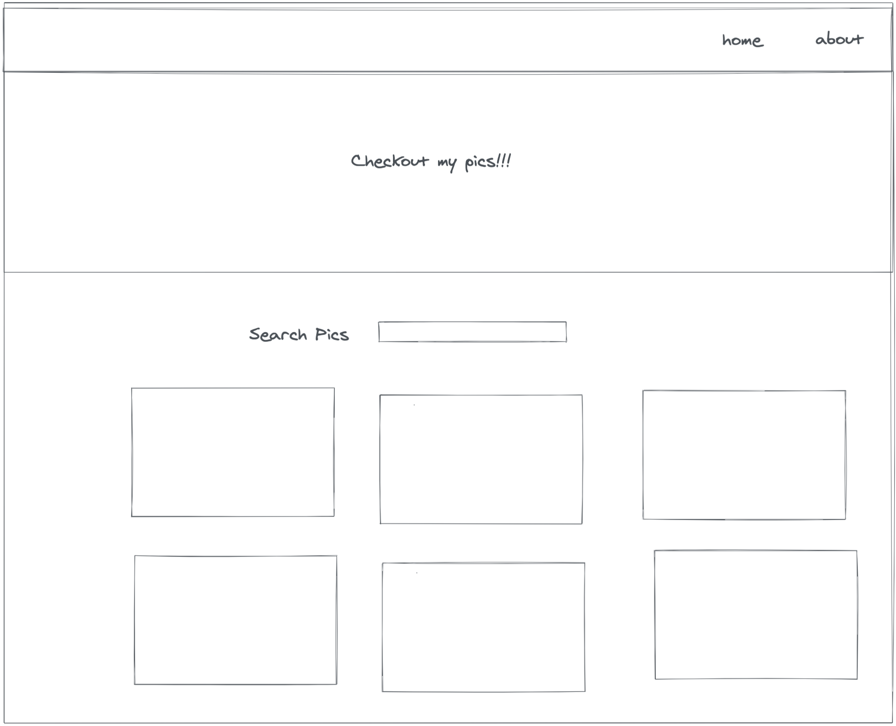
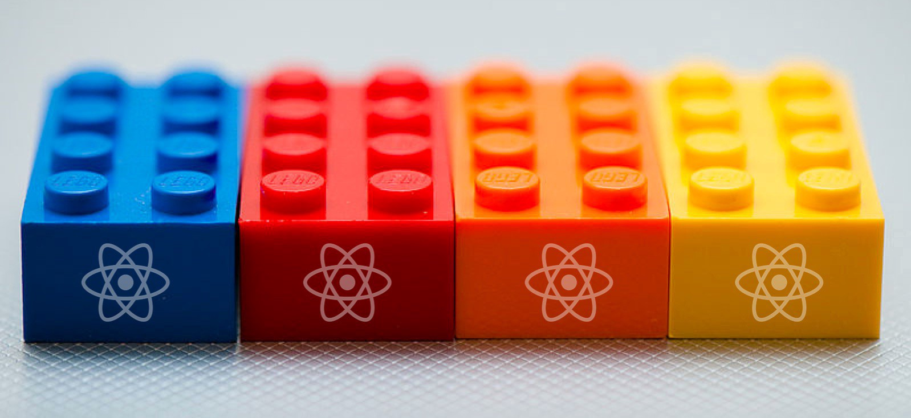

# React Basics

React is a JavaScript _library_ developed by Facebook.

<details>
  <summary>🗒️ <b>Confused on library vs framework, click here!</b></summary>

  <p>Think of a library as a dependency--a tool needed to complete a project. Tools likely will involve the need for other tools. Hammer + Nail, toothbrush + toothpaste, etc. A framework is more like the system used to complete the project: Do it yourself vs Contracting out. </p>
  
  <p>An example is a sprinkler system: A hose with a spray nozzle is the library, whereas automated sprinklers are a framework. </p>
  
  <p>Why? Because with automated sprinklers, you have the luxury of not having to do as much work, but are limited to where the sprinklers are placed. Which a hose and nozzle, you have the freedom to water where you'd like, but requires more effort.</p>
</details>

---

What makes React a library? Well, React helps us maintain the views (pages) in our applications. However, when it comes to transitions, built-in components, and routing, well that's where we'll need to bring in other tools (libraries).

## Modern App Development

In the world of frontend development, we have an acronym that gets used to describe how we build out our web sites: SPA.

Single Page Applications, or have become popular because us frontend engineers have realized not everything should require a full page reload. Some examples of this are:

- Submitting a form
- Navigating from one page to another
- Updating a list of items from a database

This is largely because modern browsers are faster and more efficient in how they handle requests, coupled with the fact that internet speeds have generally become faster.

This solves many issues (and introduces a few new ones), however the biggest issue it solves is page speed. Applications can give the impression that you're navigating to a new page, while simply updating the URL and swapping out what the user sees--all with no request actually happening.

## Why React

Contrary to the impression that React is "new" it's actually been around, 2020 marks it's 7th year of use. For this reason, companies large and small can feel confident in not only its maturity, but that it's backed by Facebook.

Often times, React is compared to [Angular](https://angularjs.org/)--another way of creating SPA's that was created by Google. While Angular changed how web sites are built before React entered, they are a framework and unfortunately didn't quite get it right their first attempt. After a few major releases and an eventual rewrite, the [new Angular](https://angular.io/) is a great choice for development, though its constant changes along the way put a pause to its dominance.

It's worth mentioning that [Vue.js](https://vuejs.org/) is currently the most popular frontend library in terms of Github stars, and is seen by many as the perfect marriage between React and Angular.

However, React is the clear winner in terms of community momentum, support, and developer tooling. For these reasons, our projects are built in React.

> 😎 **_This training site, is also built in React._**

## What is React

```js
const Header = function () {
  return React.createElement(
    'h1',
    {
      style: {
        color: 'blue',
      },
    },
    'Hello ',
    React.createElement('span', null, 'World')
  )
}
```

The above is React code. Similar to how in plain JavaScript we would use `document.createElement()`, we use `React.createElement()` to create an element. Notice the arguments that `createElement` takes:

1. The name of the element we are creating
2. Any attributes we want to add to it (id's, classes, style, etc..)
3. The inner contents of the element

However, this is a lot of code, for just a `Header`. For this reason, React comes with a shorthand syntax known as `JSX` (JavaScript eXtention) that makes this process much simpler. Here is the same function, written using JSX:

```js
const Header = () => {
  return (
    <h1 style={{ color: 'blue' }}>
      Hello <span>World</span>
    </h1>
  )
}
```

This HTML-in-JS syntax (JSX) is how React is written at any level, and how we'll be writing it in this training.

## Thinking in Components

Let's take a peek at an example webpage to see if we practice identifying components



<details>
<summary><b>🗒️ Click here to see what I came up with</b></summary>
<ol>
<li> <b>Navbar</b></li>
<li> <b>Header</b></li>
<li> <b>SearchForm</b></li>
<li> <b>BoxList</b></li>
<li> <b>BoxListItem</b></li>
<li> <b>😮The page itself</b></li>
</ol>
</details>

---

🌟 The key to building out large applications is to not. Instead compose your application into reusable bits and stitch them together like lego bricks🌟


## How to Get Started with React

Curious eyes may have noticed that in addition to CodeSandbox offering a basic JavaScript template, the also also a React template as well!

Selecting this template is the same as running the command `npx create-react-app <our-app-name>` from the terminal on our computers--assuming we have [nodeJS installed](https://nodejs.org/en/).

https://codesandbox.io/s/initial-react-app-3d71v

A couple of items worth pointing out between this React starter and the JavaScript starter from previous modules:

1. The `index.html` file (in the _public_ directory) is largely the same. Line **30** is the important line.
2. `package.json` was in previous projects, however here it is more relevant. This JSON file holds meta information about our project: name, what packages are installed, etc.

- `React` as a dependency: Let's us write JSX, create components, etc
- `ReactDOM` as a dependency: Adds browser support for React. As opposed to [mobile support](https://reactnative.dev/)

3. The heart of the application lives in the `src` directory.

`styles.css` is fairly straightforward, and `App.js` will be discussed in our projects, however `src/index.js` requires a bit of a discussion.

Lines 2-4: These lines import our dependencies. The syntax is read as follows:

"import <DefaultName> from "this package."

Note that if it is an _installed_ dependency, then it is the package name.

However if it is package we created (like App.js), then we need to provide a relative path to that file and the `.js` extension is optional.

Line 6. This should look familiar. We are grabbing that `div` from line 30 in the `public/index.html` file.

Lines 7 onward read as such: Take our `App` component and `render` it out in the `DOM`. The place in the `DOM` is going to be inside of the `div` we just grabbed, the _rootElement_.

> 🗒️ Note that the `React.StrictMode` parts are optional and simply give us better warnings during development.

## 🚨Project Time🚨

### Topics we'll learn

- 👷🏽‍♀️ How to create components
- 📁 Separate our components into different files
- 🔀 Pass data from parent to children as props
- 💅🏽 Various ways to apply CSS
  - Style tag
  - CSS files
  - CSS Modules

https://codesandbox.io/s/initial-react-project-o9lnw
