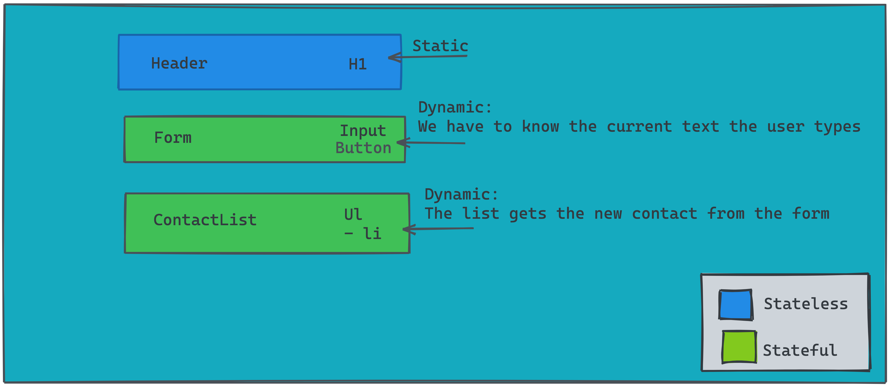

# State in React



As is the case if most applications, there will be data that is not static and may change over time.

This is known as _state_ and is the central focus of this module.

Understanding state in React is one of the most fundamental skills to be have in order to be a successful UI developer. It's worth noting that the idea of _state_ is not specific to React, but programming in general.

> 🗒️ **In React, when a component's state changes, that component--and any of its child components, are re-rendered so that the new data can be displayed.**

---

### 🚨 This section is optional and is only discussed in passing in class 🚨

In most applications you'll be dealing with, the only way to update the state is with a _class component_. Up until now, we have only used a _function component_. Using a class component allows us to tap into state, as well as lifecycle methods. Consider the following example:

👇🏽This component is simply a function that returns markup and as we've seen, can optionally take in props 👇🏽

```js
import React from 'react'

const Counter = (props) => {
  return (
    <section>
      <span>0</span>
      <button>Add 1</button>
    </section>
  )
}
```

```js
import React from 'react'
//optionally: import React, {Component} from 'react'

class Counter extends React.Component {
  state = {
    count: 0,
  }

  addOne = () => {
    this.setState((currentCount) => {
      return {
        count: currentCount + 1,
      }
    })
  }

  render() {
    return (
      <section>
        <span>{this.state.count}</span>
        <button onClick={this.addOne}>Add 1</button>
      </section>
    )
  }
}
```

Great, we created a stateful component, that will rerender itself everytime the state changes!

But what did we also create...

- Jargon
- A significantly larger component
- A heightend barrier to entry

---

# Enter React Hooks

Hooks are a somewhat new feature to React (they've been out for a year and a half, some projects have been a bit behind in adopting them).

However they aim to get rid of classes. It's worth mentioning that react hooks do not deprecate class components, however the React team has indicated that [support for classes may change](https://reactjs.org/blog/2018/11/27/react-16-roadmap.html):

> **_"Hooks don’t deprecate classes. However, if Hooks are successful, it is possible that in a future major release class support might move to a separate package, reducing the default bundle size of React."_**
>
> **_-- React Team_**

## Our First Hook: useState()

Now that we have a better idea of state, let's take another visit at our image in hopes it makes more sense:


Also, let's see what our counter example looks like with hooks

```js
const Counter = (props) => {
  return (
    <section>
      <span>0</span>
      <button>Add 1</button>
    </section>
  )
}
```

https://codesandbox.io/s/increment-with-usestate-6jo2y?file=/src/App.js

<details>
<summary>🗒️ Array Destructuring 🤔</summary>
<pre><code>const [count, setCount] = React.useState(0);</code></pre>
<p>As you may have noticed by now, JavaScript developers love shortcuts!</p>
<p><i>useState()</i> returns an array, instead of assigning index 0 and index 1 to separate variables, we instead pull them off directly. The benefit of using arrays instead of objects, is that we can name the properties we pull off whatever we want.</p>
</details>

# 🚨Let's Build: Simple Todo List🚨

https://codesandbox.io/s/react-hook-todo-list-j0ic5?file=/src/App.js
