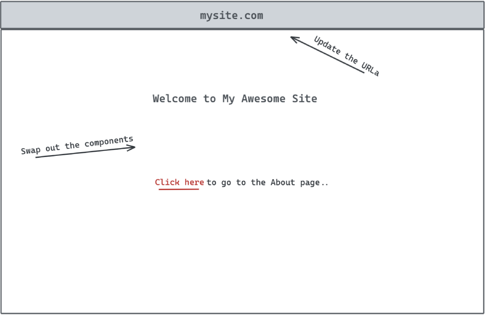

# Routing in React

Because many react applications are client-side applications--meaning there is no information gathering when the app is built, the routes that we create exist only within our browser...and are served from a single `index.html` page.

However, if that's the case, then how do we have routes `/` and `/about` routes inside of our _Single Page_ Applications?

That will be the topic we explore in this section.

## React Router

[React Router](https://reacttraining.com/react-router/web/guides/quick-start) is a library that enables routing in our React applications.

The way this is done is by updating the content on the page, and updating the URL, all without having our webpage actually refresh itself.

While React Router is powerful enough to handle many of our use cases, it's also allows us to get fairly far as long as we understand a few key Terms:

- **BrowserRouter**: The type of routing system we're using in our application
- **Route**: A component that says, "show only my children when on a given path".
- **Suspense and Lazy**: How React handles lazy-loading of routes, meaning the code for a given route isn't downloaded until a user visits the page.
- **Link**: A component that allows us to transition to other parts of our application without refreshing the page.

🚨PROJECT TIME🚨

Let's split up the application we had in the previous module in a way so that it allows us to have multiple routes in our application.

https://codesandbox.io/s/react-hook-todo-list-j0ic5?from-embed
