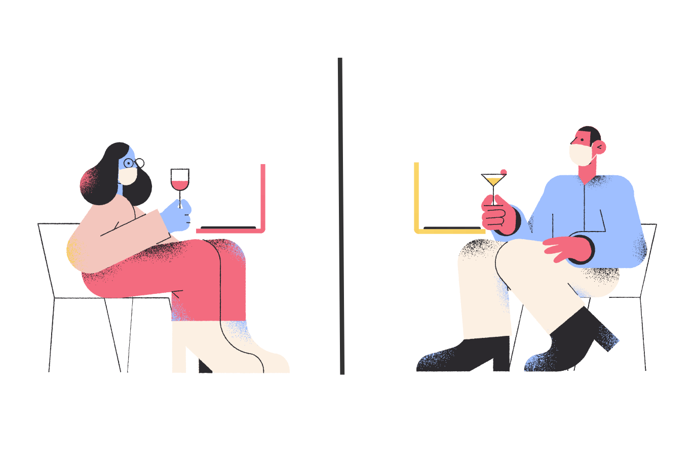
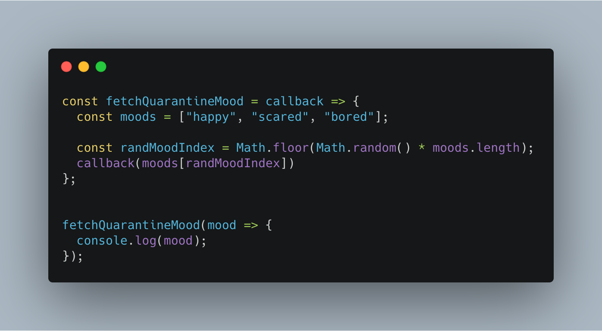
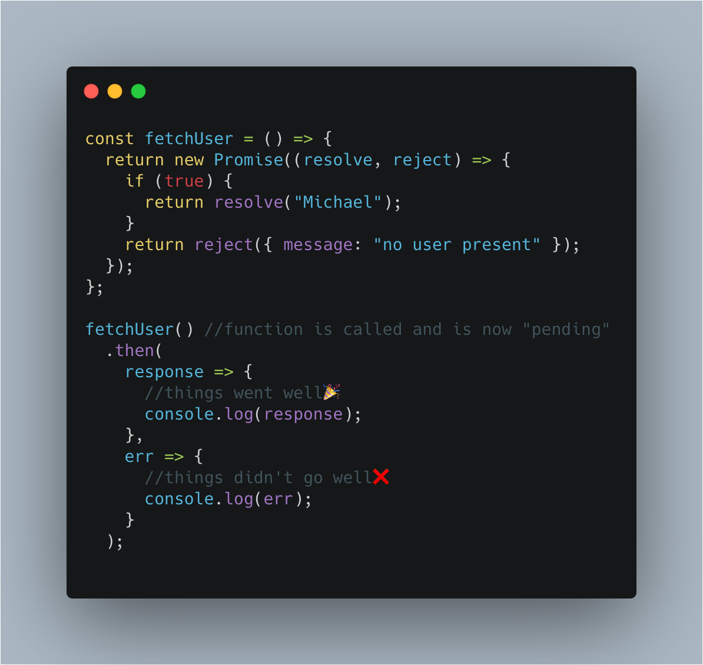
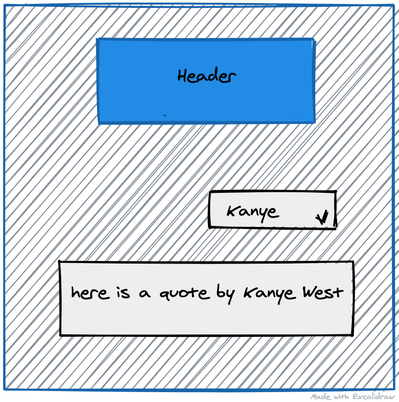

# Welcome to the Intermediate Section!

In this section we're going to kick the dirt off the tires and make sure we have a strong community understanding of JavaScript before getting into library and application specific topics.

## Asynchronous Code

Similar to what we talked about in <a href='/async-js'>the beginner async course</a>, asynchronous code will continue to be critical to creating rich applications.

However, instead of talking about how to simply use a callback, or a promise, we'll be implementing our own to ensure we are prepared to handling different types of workflows and optimize readability

As such, this section will specifically cover the following parts:

1. Creating Callbacks
2. Creating Promises
3. Project: Putting it all together
4. 🚨Homework🚨

---

### Creating Callbacks

With local businesses opening up, people can begin to safely enjoy time together at area restaurants.

Imagine you and a friend go to a restaurant. The process is usually the same wherever you go: You both provide your orders to the waiter, the waiter goes off, you two continue conversing. After a while your order comes back.

This is a callback in real life😲

Here's a simple code example of a callback

Now that we've seen an example of what a basic callback looks like, it's a good time to point out a basic fact: When **using** a callback, the implementation details of the callback logic are not important. It's a black box.

The other part to consider, is that because this is asynchronous, any code we have after our call to `fetchQuarantineMood` will run. This notion of running our synchronous code first, then running our asynchronous code is known as the JavaScript event loop and is explained amazingly well in this YouTube video👇🏽

https://youtu.be/8aGhZQkoFbQ

With a stronger understanding of callbacks, let's revisit our place order example:

https://codesandbox.io/s/callback-order-zicmh?file=/src/index.js

---

### Creating Promises

If the analogy for a callback is placing an order at a restaurant, the analogy for a promise is asking someone if they want to watch a movie.

Me: Yo👋🏽 Want to see a movie tonight?

You: Hmmm..maybe! Let me check my schedule. Promise to get back to you.

Me: Ok, I'll wait to hear back!

In the above situation, there're a couple ways this could turn out:

**Good:** You can go to the movies🍿

**Bad:** You're going to Netflix and quarantine alone😩

And in the meantime...**I don't know**.

This maps directly to how JavaScript promises work. However, we don't say _good_, _bad_ and _I don't know_.

Instead, we say **_resolved_**, **_rejected_**, and **_pending_** respectively.

Similar to before, let's take a look at what a basic promise looks like.

[Here's a link](https://chrome.google.com/webstore/detail/json-formatter/bcjindcccaagfpapjjmafapmmgkkhgoa?hl=en) to a chrome extension in case your json isn't formatted.

**Project: Promise Chaining and Error Handling**

https://codesandbox.io/s/promises-project-7q013

🚨Homework: Challenge Area🚨

https://codesandbox.io/s/async-homework-u7vyb?file=/src/index.js
