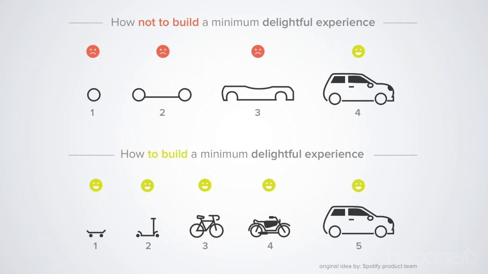

You may have heard about React. You may have written React. However, many developers write React code without an understanding of what is happening under the hood. In this section we'll go behind the scenes to understand all the magic that is occuring when you start up a React application.


> 📝 For a quick primer on React, checkout the [basics section](https://fed-training.netlify.com/react-basics) to get more insight.

## Building Through Iteration



Overwhelmingly, when creating a website with React, we say "We are building a React application". This has been repeated over the years so much that there's now a false impression that if one is build an app in React, it has to be React from beginning to end.

This is false.

React is designed to be modular and thus React can be added to a simple HTML page without any build configuration.

https://codesandbox.io/s/young-rain-u8txu?file=/index.html

This is great because if a team is wanting ot transition to React, they can evaluate it incrementally, without needing to do a complete refactor🏅

#### Adding in JSX

As we create more components in our application, it becomes harder to write a bunch of `React.createElement()` functions. Because of this, the React team allows us to write our code in JSX--which is what most folks think of when they think of React.

However, JSX syntax isn't JavaScript and definitely isn't supported in browsers. We need a way to tell our convert JSX to something the browser understands. That's where [babel](https://babeljs.io/) comes in.

By default. Babel will look at the code we tell it to--but it won't do anything 😅

To have it _transpile_ our code, we use either a _loader_ or a _preset_. A _loader_ is a specific rule, "transform arrow functions in normal function" or "transform my `let` and `const` variables in to `var`s". In contrast, a preset is just a bundle of loaders.

🌟

Now that we understand how babel works, let's revisit the application we had earlier and add the following script to our application

```js
<script src="https://unpkg.com/@babel/standalone/babel.min.js"></script>
```

Additionally, we need to let our JavaScript file know that it's expecting code from Babel. To do this, we add a `type="text/babel"` to our bottom script tag.

Just like that, we now have a site that is minimally using React, and transpiled by Babel🎉

> 🗒️ It's good to note that in our codesandbox projects so far, the JavaScript template did all this for us by using a bundler known as [parcel](https://parceljs.org/).

### Working Locally


We brought in React and used it without JSX. As requirements changed, we brought in a transpiler to allow us to write JSX.

But now, we have many script tags in our application. Additionally, we still aren't able to use the many features we've come to expect in modern development.

We've now reached a point where we need a bundler. Specifically, we're now ready to learn about [webpack](https://webpack.js.org/).

We'll start by first setting up a project to us Babel. Once we've verified that's working, we'll transition to setting up a full build pipeline with babel.
