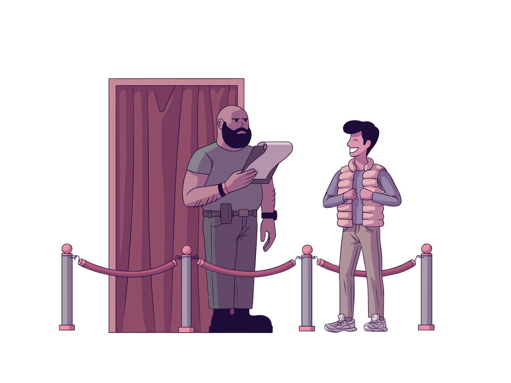

Throughout this intermediate course, we've ensured we had a core understanding of JavaScript, as well as understood what was happening under the hood when building a react application.

However, even though we've reached our desired destinatin of building with React, we have one final check at the door to go through.

## React Overview

We won't go into the basics of what a component is in this section. However if you're finding that you may need a refresher, feel free to check out the [React Basics module](/react-basics) from the beginner series.

Additionally, this training series does not use class-based components and instead used React hooks. Similarly, a conceptual and entry level understanding of routing is expected. If wanting to get an understanding of either of those topics, the following links will direct to the beginner series where they are covered:

React Hooks Basics can be found [here](/react-hooks-1)

React Routing Basics can be found [here](/routing)

### Project and Homework

Once done reading the above sections, a knowledge check can be made by going through the following project, and as a homework assignment trying to create a new route that is lazily loaded

https://codesandbox.io/s/frosty-leaf-ubc76
