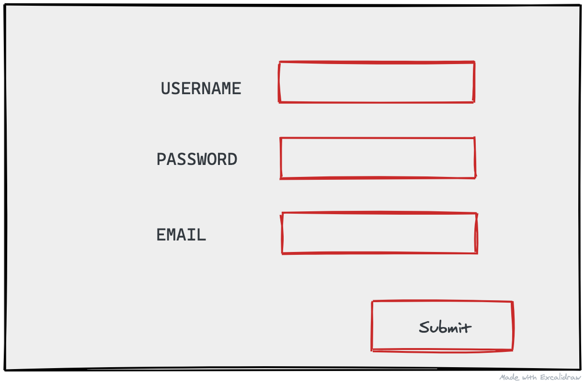
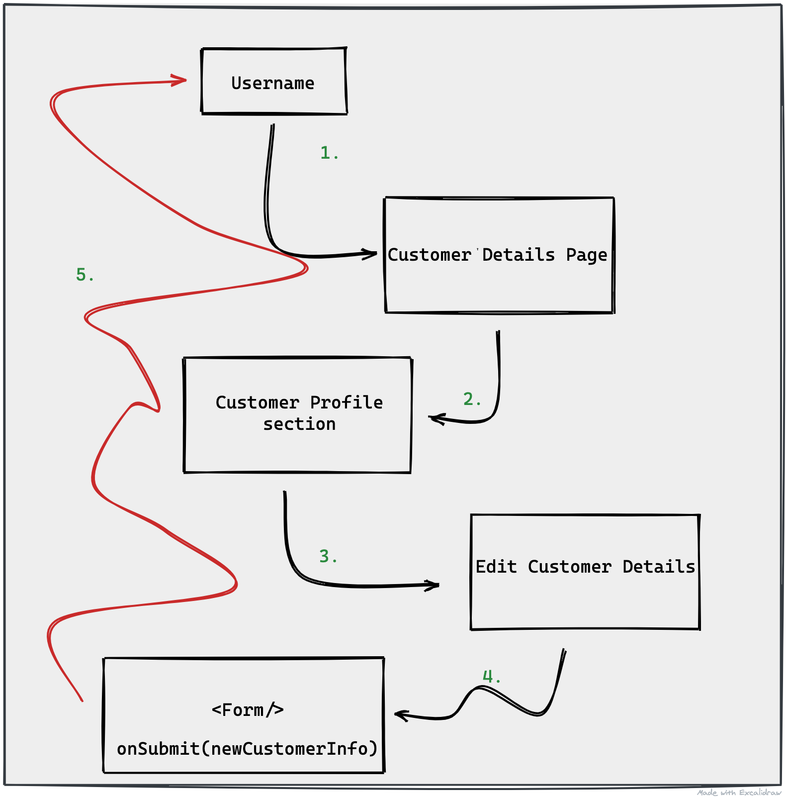

As frontend developers, it's not unheard of for us to spend so much time on how the application looks and feels, that we can unknowingly create unmanageable pieces of code.

In particular, state in our applications is one of the biggest painpoints when it comes to architecture. The reason being, is because it means we have to pause. We have to stop building and we have to now think about the access patterns that our customers will need so that developer overhead can be reduced.

## PART 1: Managing Component State

So far, when it comes to managing component state in React we've discussed `useState`. However, let's consider the following image:



Given the above UI, our code would then look something like below:

```js
// our UI component
const ContactForm = () => {
  // how to create the state
  const [usernameInput, setUsernameInput] = useState('')
  const [passwordInput, setPasswordInput] = useState('')
  const [emailInput, setEmailInput] = useState('')

  // how to interact with the state
  const handleInputChange = (e) => setUsernameInput(e.target.value)
  const handlePasswordChange = (e) => setPasswordInput(e.target.value)
  const handleEmailChange = (e) => setEmailInput(e.target.value)
  const handleSubmit = (e) => {
    e.preventDefault()
    //todo: send off state values.
  }

  // return our markup
  return (
    <form onSubmit={handleSubmit}>
      <label>
        USERNAME
        <input
          name="usernameInput"
          type="text"
          value={usernameInput}
          onChange={handleInputChange}
        />
      </label>
      <label>
        PASSWORD
        <input
          name="passwordInput"
          type="password"
          value={passwordInput}
          onChange={handlePasswordChange}
        />
      </label>
      <label>
        EMAIL
        <input
          name="emailInput"
          type="email"
          value={emailInput}
          onChange={handleEmailChange}
        />
      </label>
      <button>Submit</button>
    </form>
  )
}
```

> 👀 Note that our component above is actually doing quite a few things.

Not only is it _telling_ what the markup looks like. It's also _showing_ how the state is being managed. Sometimes, this isn't that big of a deal, and if the above style is what works for you, then by all means. However, consider the fact that all the pieces of state in the above form are related. So instead of our state being comprised of three different pieces. We could represent it as a single piece of state, by switching it to an object:

https://codesandbox.io/s/managing-form-state-starter-s2gti?file=/src/App.js

## Intro to useReducer

Pushing the bounds on `useState` is a great way to iterate and find out when it's appropriate to switch to something meant to handle more complex scenarios. When we reach those moments, `useReducer` is the next step for managing state within our components.

### 🚨 Breaking Down Jargon 🚨

**Reducer**: A function that takes in data and returns a single value; alt) A function that returns a new piece of state.

**Action**: An object with a `type` property (required). 🗒️ This object can optionally contain other properties.

**Dispatch**: A function that sends an action to the reducer.

https://media.giphy.com/media/Yr0Wt4LNJj1ftnp222/giphy.gif

//convert initial sandbox to use `useReducer`

---

## PART 2: Managing Application Level (Global) State

In many applications, having all of our state read and updated in a single component is simply feasible. More likely, we'll want to use `props` to pass data down, and if a prop is a function, we can pass data up.

Similiar to `useState` this is perfectly fine in simple scenarios, however consider the following:



At each level, we would have to pass a prop down, and when we finally got to the component that would update the username, we would have to pass a function all the way back up. This is known as **prop drilling** and takes building react applications to know when it's fine, and to know when it's a [code smell](https://en.wikipedia.org/wiki/Code_smell).

## Enter useContext

**Context:** A piece of global state

The `useContext` hook gives us the ability to make pieces of data available globally (truly global, and not just living at the parent level).

When using the _context_ methods provided by React, only the components that _need_ to access global state have to deal with importing the needed tools.

Here are the tools we'll be using:

**createContext**: A function used to create a piece of global state. It returns an object (_MyContext_) so we can interact with our state.

**MyContext.Provider**: A component that we can use to wrap parts of our application. This component takes in a `value` prop that sets the initial value.

**useContext**: A React hook that accepts the context slice (_MyContext_) and returns the value provided in `MyContext.Provider`.

> 🗒️ You can have more than one Context slice.
> 🗒️ Everytime a provider's value changes, the componets using `useContext` rerender--as well as all of their children
> 🗒️ Context Providers don't have to live at the `App` level, but can live at any level.
> 🗒️ `useReducer` alongside `useContext` is a _very_ common pattern and modularizes the concepts from redux.

As always, let's take a look at an example:

https://codesandbox.io/s/managing-form-state-context-starter-y9uv5?file=/src/pages/App.js

🚨 Homework Assignment 🚨

Given the sandbox below, perform the following:

1. Split the application into multiple files, as done in the class example
2. Add a reducer to the application so that the ThemeContext can be toggled when the button is clicked.

https://codesandbox.io/s/ecstatic-ride-qh1x9?file=/src/App.js
